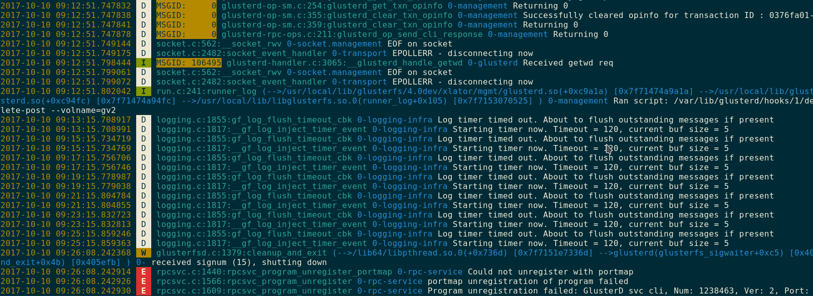

# Gluster Log Tools

## Colorize the log files
Colored output for Gluster logs.

    cat /var/log/glusterfs/glusterd.log | gluster-log colorize

## JSON output
Log messages can be converted to `json` for better integration with external
tools/applications.
    
    cat /var/log/glusterfs/glusterd.log | gluster-log json

    {
        "known_format": true,
        "ts": "2017-10-10 09:26:08.243588",
        "log_level": "E",
        "msg_id": "",
        "file_info": "rpcsvc.c:1566:rpcsvc_program_unregister",
        "domain": "0-rpc-service",
        "message": "portmap unregistration of program failed",
        "fields": {
        }
    },
    {
        "known_format": true,
        "ts": "2017-10-10 09:26:08.243591",
        "log_level": "E",
        "msg_id": "",
        "file_info": "rpcsvc.c:1609:rpcsvc_program_unregister",
        "domain": "0-rpc-service",
        "message": "Program unregistration failed: Gluster MGMT Handshake, Num:
    1239873, Ver: 1, Port: 0",
        "fields": {
        }
    }
    ]

Output can be redirected to file for post processing

    cat /var/log/glusterfs/glusterd.log | gluster-log json > ~/glusterd_log.json

## Future plans
- Support for filters for each field(Example, filter based on given time range,
  filter based on an event etc..)
- Support for multiple log files processing
- Support for file input(`gluster-log colorize <LOGFILE>`)
