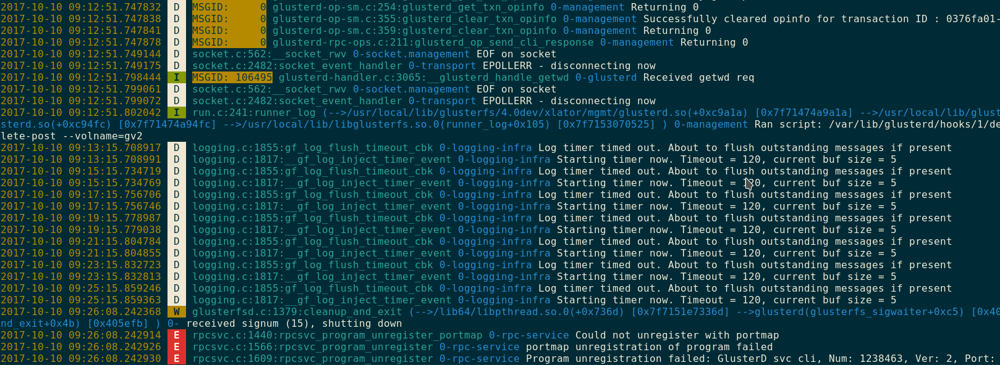

# Utility to parse Gluster Log files

## Install

    pip install glusterlog

## Usage
gluster-log-colorize: To colorize the log lines

    cat /var/log/glusterfs/glusterd.log | gluster-log-colorize
    tail /var/log/glusterfs/glusterd.log | gluster-log-colorize
    grep "MSGID: 106143" /var/log/glusterfs/glusterd.log | gluster-log-colorize

To colorize entire log file and then open using `less`

    cat /var/log/glusterfs/glusterd.log | gluster-log-colorize > /tmp/glusterd_color.log
    less -R /tmp/glusterd_color.log

gluster-log-json: To convert log lines to json

    tail -2 /var/log/glusterfs/glusterd.log | gluster-log-json

    {
        "domain": "0-rpc-service",
        "log_level": "E",
        "known_format": true,
        "fields": {},
        "timestamp": "2017-10-10 09:26:08.243588",
        "message": "portmap unregistration of program failed",
        "msg_id": null,
        "file_info": "rpcsvc.c:1566:rpcsvc_program_unregister"
    }
    {
        "domain": "0-rpc-service",
        "log_level": "E",
        "known_format": true,
        "fields": {},
        "timestamp": "2017-10-10 09:26:08.243591",
        "message": "Program unregistration failed: Gluster MGMT Handshake, Num: 1239873, Ver: 1, Port: 0",
        "msg_id": null,
        "file_info": "rpcsvc.c:1609:rpcsvc_program_unregister"
    }

Above command will convert every line as independent json object, if we want a
single json file then use `--single-json`

    tail -2 /var/log/glusterfs/glusterd.log | gluster-log-json --single-json > /tmp/glusterd.json

    [
    {
        "domain": "0-rpc-service",
        "log_level": "E",
        "known_format": true,
        "fields": {},
        "timestamp": "2017-10-10 09:26:08.243588",
        "message": "portmap unregistration of program failed",
        "msg_id": null,
        "file_info": "rpcsvc.c:1566:rpcsvc_program_unregister"
    },
    {
        "domain": "0-rpc-service",
        "log_level": "E",
        "known_format": true,
        "fields": {},
        "timestamp": "2017-10-10 09:26:08.243591",
        "message": "Program unregistration failed: Gluster MGMT Handshake, Num: 1239873, Ver: 1, Port: 0",
        "msg_id": null,
        "file_info": "rpcsvc.c:1609:rpcsvc_program_unregister"
    }
    ]

## Use as library

    from glusterlog import parse

    parsed_data = parse(log_line)
    print parsed_data

Parsed data object contains following information,

    known_format - True|False, Use this to find parse is successful or not
    ts           - Timestamp
    log_level    - Log Level
    msg_id       - MSG ID
    file_info    - File, Line and function information, For example: "event-epoll.c:602:event_dispatch_epoll_worker"
    domain       - Log domain
    message      - Log Message
    fields       - Dict with key value pairs if structured logging is used

## Example
To find how many times Geo-replication worker is started/restarted between Time1 and Time2. The example scripts look for Geo-rep log message like below to get necessory information.

    [2017-07-06 10:01:18.680167] I [monitor(monitor):280:monitor] Monitor: starting gsyncd worker   brick=/bricks/b1        slave_node=ssh://root@f241:gluster://localhost:gv2
    [2017-07-06 10:01:18.719711] I [monitor(monitor):280:monitor] Monitor: starting gsyncd worker   brick=/bricks/b2        slave_node=ssh://root@f241:gluster://localhost:gv2

Example script

    import sys

    from glusterlog import parse

    time1 = sys.argv[2]  # Second argument
    time2 = sys.argv[3]  # Third argument
    msg = "starting gsyncd worker"

    count_data = {}
    with open(sys.argv[1]) as f:
        for line in f:
            data = parse(line)
            if data.message == msg and data.ts >= time1 and data.ts <= time2:
                brick = data.fields.get("brick", None)
                if brick is None:
                    continue

                if count_data.get(brick, None) is None:
                    count_data[brick] = 0

                count_data[brick] += 1

        print "{0:20s} Number of Restarts".format("Brick")
        for k, v in count_data.items():
            print "{0:20s} {1}".format(k, v)

Example usage of above script,

    $python georep_worker_restarts_count.py /var/log/glusterfs/geo-replication/gv1/ssh%3A%2F%2Froot%40192.168.122.208%3Agluster%3A%2F%2F127.0.0.1%3Agv2.log 2017-07-06 "2017-07-06 10:34"

Example output:

    Brick                Number of Restarts
    /bricks/b1           2
    /bricks/b2           2
